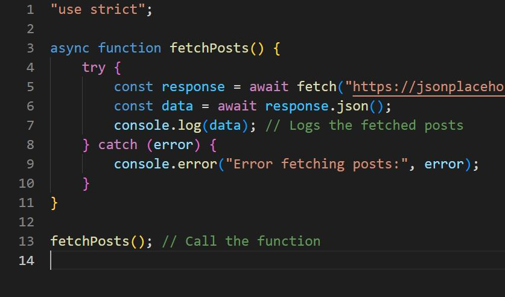
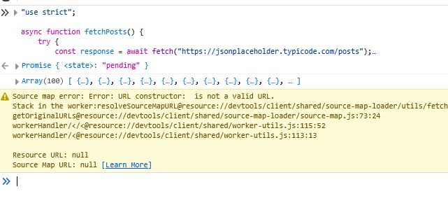
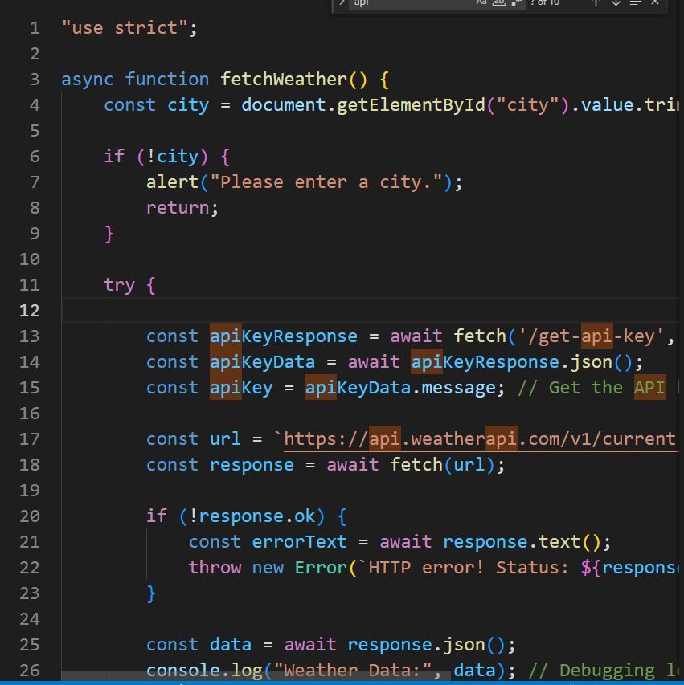
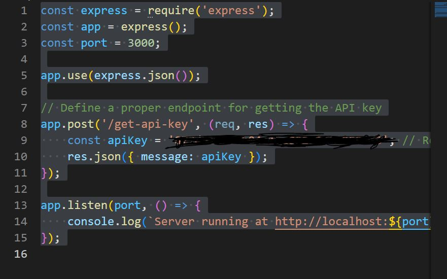

# Weather Application Assignment

## Part 1: Understanding `async`, `fetch`, and `await`

This is the first part of my assignment where I demonstrate my understanding of asynchronous programming using `async`, `fetch`, and `await`. The focus is on fetching data from an API, handling asynchronous requests, and displaying the result on a webpage.

### Image of My Work:
Here’s a screenshot showing my implementation of this concept:

---

## Part 2: Weather API Integration

In this part of the assignment, I integrate the weather API to fetch current weather data for a specified city. I used the `WeatherAPI` to retrieve data like temperature, weather conditions, and icons.

### Features:
- Enter a city name to get the current weather information.
- Displays temperature, weather condition, and weather icon.
- Demonstrates how to securely handle API keys via a server.

### Technologies Used:
- **JavaScript (Async/Await)**: Used for fetching weather data.
- **Express (Node.js)**: A backend server to securely fetch API keys.
- **Tailwind CSS**: For styling the frontend.

---

## Screenshots:

### Weather App in Action:
Here are the screenshots showing different parts of the weather app in action:

1. **Screenshot 1**:  
   

2. **Screenshot 2**:  
   

3. **Screenshot 3**:  
   

---
 